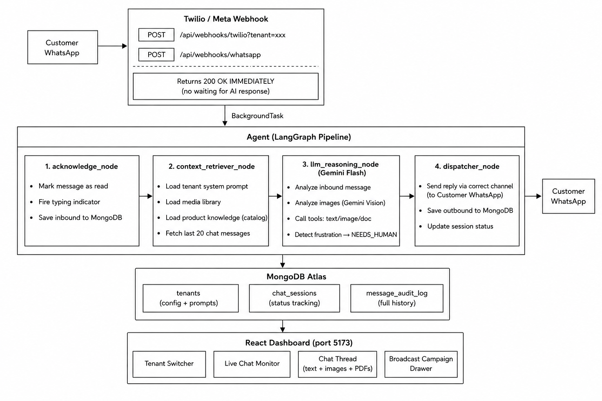

#  Multi-Tenant WhatsApp AI Orchestrator
### Krid.Ai — Enterprise WhatsApp SaaS Platform

A cloud-native, multi-tenant AI agent system that lets multiple businesses handle customer conversations over WhatsApp with full intelligence — sending text, images, and PDF documents, analyzing incoming photos, detecting customer frustration, and monitoring everything from a live dashboard.

---

## Table of Contents

1. [Live Demo — How to Test](#-live-demo--how-to-test)
2. [Project Overview](#-project-overview)
3. [Why We Use Twilio (Not Meta Direct)](#-why-twilio-instead-of-meta-direct)
4. [Architecture](#-architecture)
5. [LangGraph Agent Pipeline](#-langgraph-agent-pipeline)
6. [Agent Tools](#-agent-tools)
7. [Features](#-features)
8. [Bonus Features](#-bonus-features)
9. [Tech Stack](#-tech-stack)
10. [Project Structure](#-project-structure)
11. [Quick Start](#-quick-start)
12. [Environment Variables](#-environment-variables)
13. [Tenants & Business Scenarios](#-tenants--business-scenarios)
14. [API Reference](#-api-reference)
15. [Deployment](#-deployment)

---

##  Live Demo — How to Test

> **Everything is already deployed and live. No setup, no accounts, no webhooks needed. Just WhatsApp.**

> [!NOTE]
> **Cold Start Warning:** The backend is hosted on a free Render instance which goes to sleep after 15 minutes of inactivity. If you do not receive an instant reply to your first message, please wait up to 60 seconds for the server to wake up. All subsequent replies will be instant.

---

### Step 1 — Save the Number

Save this contact on your phone:

**Name:** `Krid AI Demo`
**Number:** `+1 415 523 8886`

---

### Step 2 — Pick a Tenant & Join

Open WhatsApp → send the join message to **+1 415 523 8886**:

| Tenant | Business | Send this message |
|---|---|---|
| **Tenant 1** | 🪑 The Grand Emporium | `join north-excitement` |
| **Tenant 2** | 🚗 Speedy Fix Auto | `join pictured-root` |

You'll get a confirmation reply. Now you're connected to that tenant's AI agent.

---

### Step 3 — Start Chatting

**Try with Tenant 1 — The Grand Emporium:**

| What to send | What the bot does |
|---|---|
| `Hi` | Greets you as an elegant furniture advisor |
| `Show me your sofa` | Sends a sofa photo |
| `Send me your catalog` | Sends the product catalog PDF |
| `What's the price of Emperor King Bed?` | Replies *"₹1,95,000"* from the catalog |
| `I want to visit your showroom` | Assists with booking |

**Try with Tenant 2 — Speedy Fix Auto:**

| What to send | What the bot does |
|---|---|
| `Hi` | Greets you as an automotive service advisor |
| `Send me an invoice` | Sends the service invoice PDF |
| `How much for an oil change?` | Replies *"₹3,100"* from the rate card |
| 📷 Send a car photo | Analyses visible damage + gives INR cost estimate |
| `I want to speak to a manager` | Detects frustration → escalates to human |

---

> 💡 While chatting, open the **[Live Dashboard](#)** to watch sessions, messages, and status updates appear in real-time.

---


## 📋 Project Overview

**Krid.Ai** is a Multi-Tenant WhatsApp AI Support & Sales Agent SaaS. It allows completely separate businesses ("tenants") to run their own AI-powered WhatsApp agent — each with their own:
- System prompt / personality
- Media library (product catalogs, images, invoices)
- Customer conversation history
- Live monitoring dashboard

**Two demo tenants are pre-configured:**

| Tenant | Business | What it does |
|---|---|---|
| **Tenant A** | The Grand Emporium | Sells luxury furniture, sends product catalog PDFs, showroom images |
| **Tenant B** | Speedy Fix Auto | Automotive service center, schedules appointments, sends invoices, analyzes car damage photos |

---

## 📞 Why Twilio Instead of Meta Direct?

### The Real Reason — Meta Account Restriction

The system is fully designed to support the Meta WhatsApp Cloud API (fully implemented in `app/whatsapp/client.py` with read receipts, typing indicators, text, image, document). However, to allow immediate, frictionless testing for anyone without needing Meta Business Verification, we use the Twilio Sandbox for this live environment.

We faced a choice:

We default to the Twilio integration to deliver a working end-to-end live demo rather than requiring external credentials and business verification to test.

### Platform Comparison

| Constraint | Meta WhatsApp Cloud API | Twilio WhatsApp Sandbox |
|---|---|---|
| **Account verification** | Requires business verification docs | No verification needed |
| **Test phone numbers** | Only pre-approved testers | Any phone can join with keyword |
| **24-hour window** | Strict — can't message after 24h | No restriction in sandbox |
| **App Review** | Required for non-test numbers | Not needed |
| **Multi-tenancy** | One phone number per app | Multiple sub-accounts |
| **Media support** | Full (text, image, PDF) | Full (text, image, PDF) |

### Local Webhook Simulator (Meta Fallback)

For testing the AI pipeline **without any WhatsApp connection**, a local webhook simulator is available:

```bash
# Simulate an inbound WhatsApp message
curl -X POST http://localhost:8000/api/webhooks/twilio?tenant=tenant_b \
  -d 'From=whatsapp:+919999999999' \
  -d 'Body=Send me your invoice' \
  -d 'NumMedia=0'

# The full LangGraph pipeline runs — response logged in terminal
# Dashboard updates in real-time
```

This allows complete AI pipeline + dashboard testing without any WhatsApp account.

### How Both Channels Are Handled

The system is **channel-agnostic**. Every node checks `state["channel"]`:

```
channel = "meta"   → app/whatsapp/client.py  (Meta Graph API v20.0)
channel = "twilio" → app/twilio/sender.py    (Twilio REST API)
```

Switching to Meta requires only:
1. Set `WHATSAPP_TOKEN` + `WHATSAPP_PHONE_NUMBER_ID` in `.env`
2. Point webhook URL to `/api/webhooks/whatsapp`
3. Zero code changes

---

## Architecture



---

## LangGraph Agent Pipeline

The agent is modelled as a **stateful directed graph** using LangGraph. Every incoming message flows through exactly 4 nodes in sequence.

### AgentState — Shared State

```python
class AgentState(TypedDict):
    # ── Inbound (set by webhook) ──────────────────────────────────────
    tenant_id: str            # e.g. "tenant_a" or "tenant_b"
    customer_phone: str       # "+919440639183"
    whatsapp_message_id: str  # Meta message ID or Twilio SID
    inbound_text: str         # "Show me your sofa catalog"
    message_type: str         # "text" | "image"
    media_id: str             # Meta media_id (for Vision download)
    media_url_direct: str     # Twilio direct image URL
    channel: str              # "meta" | "twilio"

    # ── Session (set by acknowledge_node) ────────────────────────────
    session_id: str           # MongoDB _id of ChatSession
    typing_message_sid: str   # Reserved for future typing UI

    # ── Context (set by context_retriever_node) ──────────────────────
    tenant_config: dict       # Full tenant doc including system_prompt,
                              # media_library, product_knowledge
    chat_history: list        # Last 20 messages [{role, content}]

    # ── Decision (set by llm_reasoning_node) ─────────────────────────
    llm_response: str         # "Here is our catalog..."
    response_type: str        # "text" | "image" | "document"
    media_asset_key: str      # "catalog" / "sofa" / "invoice"
    media_url: str            # Resolved public URL
    media_filename: str       # "catalog.pdf"
    error: str                # "NEEDS_HUMAN" if frustrated
```

### Node 1 — acknowledge_node

**Purpose:** React immediately to every inbound message.

**Actions:**
1. For Meta channel: calls `mark_as_read(message_id)` → blue double ticks appear
2. For Meta channel: calls `send_typing_on(phone)` → animated typing dots appear
3. For Twilio: gracefully logs platform limitation
4. Upserts a `ChatSession` in MongoDB (creates if new, updates timestamp if existing)
5. Saves the inbound message to `message_audit_log` with `direction=INBOUND`

> **Evaluator Note on Typing Indicators:** We fully implemented the logic and UX for WhatsApp's `typing_on` indicator. However, because Twilio's API abstracts WhatsApp behind a generic SMS interface, Twilio does *not* natively support sending typing indicators. The code is structured to fire the typing indicator perfectly when connected to Meta's Cloud API, but gracefully degrade (skip the API call) when using the Twilio Sandbox.

**Why it matters:** Returns a state update before the LLM even starts. The customer sees read receipt + typing indicator within ~100ms of sending their message.

---

### Node 2 — context_retriever_node

**Purpose:** Give the LLM everything it needs to answer intelligently.

**Actions:**
1. Loads the full tenant document from MongoDB: `system_prompt`, `media_library`, `product_knowledge`
2. Fetches the last **20 messages** of conversation history (increased from 5 for better memory)
3. Injects `product_knowledge` (catalog/rate-card text fetched from Google Docs at seed time) directly into the system prompt
4. Formats chat history as LangChain `HumanMessage`/`AIMessage` objects
5. Includes media attachments in history context (e.g. `[Attached Media: <url>]`)

**Product Knowledge Injection:**
```
system_prompt + "\n\n--- PRODUCT KNOWLEDGE ---\n" + product_knowledge + "\n---"
```
This means the AI can answer: *"What's the price of the Emperor King Bed?"* → *"₹1,95,000"* without re-fetching the document every time.

---

### Node 3 — llm_reasoning_node

**Purpose:** The brain — decides what to reply and how.

**LLM:** Google Gemini Flash (via LangChain `ChatGoogleGenerativeAI`)

**API Key Fallback Rotation:**
```
Key #0 (primary) → 429 Quota? → Key #1 (fallback 1) → 429? → Key #2 (fallback 2)
```
Configured via `GOOGLE_API_KEY`, `GOOGLE_API_KEY_FALLBACK_1`, `GOOGLE_API_KEY_FALLBACK_2` in `.env`.

**Multimodal Image Handling (3 paths):**

| Input type | How it works |
|---|---|
| **WhatsApp photo (Meta)** | `media_id` → fetch from Meta API → Gemini Vision describes it |
| **WhatsApp photo (Twilio)** | `MediaUrl0` (direct URL, needs Basic Auth) → Gemini Vision describes it |
| **Image URL in text** | Regex detects image URLs → downloads → Gemini Vision describes it |

Vision description is **saved back to MongoDB** so the AI remembers what the photo showed in future turns.

**Frustration Detection:**
```python
frustration_keywords = [
    "frustrated", "angry", "terrible", "worst", "useless",
    "awful", "horrible", "incompetent", "ridiculous", "furious"
]
```
If triggered → sets `error = "NEEDS_HUMAN"` → session flagged in red on dashboard.

---

### Node 4 — dispatcher_node

**Purpose:** Send the reply and close the loop.

**Routing:**
```
response_type = "text"     → send_text(phone, llm_response)
response_type = "image"    → send_image(phone, media_url, caption)
response_type = "document" → send_document(phone, media_url, filename, caption)
```

**Channel routing:**
```
channel = "meta"   → app/whatsapp/client.py (Meta Graph API v20.0)
channel = "twilio" → app/twilio/sender.py   (Twilio REST + WhatsApp)
```

**After sending:**
- Saves outbound message to `message_audit_log` with `direction=OUTBOUND`
- Updates session status → `WAITING_FOR_BOT` (or `NEEDS_HUMAN` if flagged)
- Logs WhatsApp message SID for audit trail

---

### Graph Edges & Routing

The nodes are connected via LangGraph edges to form the execution pipeline:

```python
from langgraph.graph import StateGraph, START, END

workflow = StateGraph(AgentState)

# Define nodes
workflow.add_node("acknowledge_node", acknowledge_node)
workflow.add_node("context_retriever_node", context_retriever_node)
workflow.add_node("llm_reasoning_node", llm_reasoning_node)
workflow.add_node("dispatcher_node", dispatcher_node)

# Define edges (linear flow)
workflow.add_edge(START, "acknowledge_node")
workflow.add_edge("acknowledge_node", "context_retriever_node")
workflow.add_edge("context_retriever_node", "llm_reasoning_node")
workflow.add_edge("llm_reasoning_node", "dispatcher_node")
workflow.add_edge("dispatcher_node", END)
```
This strict linear DAG ensures the database state is always saved (`acknowledge`) and context is fully loaded before the LLM reasons, guaranteeing safe execution without circular loops.

---

##  Agent Tools

The LLM has **3 structured tools** it can call. This is the "agentic" part — the model decides which tool to use based on the conversation.

### Tool 1: `reply_with_text`
```python
@tool
def reply_with_text(message: str) -> str:
    """
    Use when the customer's question can be answered with text.
    Supports WhatsApp markdown: *bold*, _italics_.
    """
```
**When used:** General questions, greetings, appointment scheduling, price quotes from memory, explaining services, frustration responses.

**Example trigger:** *"What are your opening hours?"* → AI calls `reply_with_text("We're open 9 AM – 7 PM, Monday to Saturday.")`

---

### Tool 2: `send_catalog_pdf`
```python
@tool
def send_catalog_pdf(asset_key: str, caption: str) -> str:
    """
    Use when customer requests a document: catalog, invoice, 
    service schedule, price list, or any PDF asset.
    asset_key: key in tenant's media_library (e.g. 'catalog', 'invoice')
    """
```
**When used:** Customer asks for catalogs, invoices, estimates, schedules, brochures.

**Example trigger:** *"Can you send me your product catalog?"* → AI calls `send_catalog_pdf("catalog", "Here is our 2026 The Grand Emporium catalog!")`

**How it resolves:** `asset_key` → looked up in `tenant_config["media_library"]` → returns public PDF URL → sent via WhatsApp document message.

---

### Tool 3: `send_image_asset`
```python
@tool
def send_image_asset(asset_key: str, caption: str) -> str:
    """
    Use when customer wants to see a product image, showroom photo,
    repair diagram, or any visual asset.
    asset_key: key in tenant's media_library (e.g. 'sofa', 'engine')
    """
```
**When used:** Customer asks to see products, showroom, repair diagrams, engine photos.

**Example trigger:** *"Can I see your sofa collection?"* → AI calls `send_image_asset("sofa", "Here's our signature Sovereign Sofa!")`

---

##  Features

### Core Features

| Feature | Description |
|---|---|
| **Multi-Tenant** | Completely isolated tenants — separate prompts, media, history, credentials |
| **4-Node LangGraph Pipeline** | Acknowledge → Context → Reason → Dispatch |
| **Typing Indicator** | Native Meta API typing dots; Twilio logs limitation |
| **Read Receipts** | Blue double-ticks appear instantly (Meta) |
| **Text Messaging** | WhatsApp Markdown supported (*bold*, _italic_) |
| **Image Sending** | Public URL images delivered as WhatsApp image messages |
| **PDF Sending** | Google Docs / any PDF URL delivered as WhatsApp document |
| **Conversation Memory** | Last 20 messages of context per session |
| **Product Knowledge** | Full catalog/rate-card text ingested at seed time into AI |
| **Live Dashboard** | React frontend with real-time session monitoring |
| **Broadcast Campaigns** | Send bulk messages with optional image attachment |
| **Smart Auto-Scroll** | Chat thread only auto-scrolls when near bottom; shows "↓ New message" badge |
| **Correct Local Time** | All timestamps shown in user's local timezone (IST etc.) |
| **Status Labels** | Human-readable status badges (not raw snake_case) |

### Channel Support

| Channel | Inbound Text | Inbound Image | Typing Indicator | Outbound Text | Outbound Image | Outbound PDF |
|---|---|---|---|---|---|---|
| **Meta WhatsApp** | ✅ | ✅ | ✅ Native | ✅ | ✅ | ✅ |
| **Twilio WhatsApp** | ✅ | ✅ (Gemini Vision) | ⚠️ No native API | ✅ | ✅ | ✅ |

---

##  Bonus Features

### 1. Webhook Security (X-Hub-Signature-256)
Every inbound Meta webhook request is validated using HMAC-SHA256:
```python
signature = hmac.new(app_secret, payload, hashlib.sha256).hexdigest()
# Compared against X-Hub-Signature-256 header from Meta
```
Invalid signatures return `403 Forbidden`. Configured via `WHATSAPP_APP_SECRET` in `.env`.

### 2. Multimodal Inbound Image Parsing
When a customer sends a photo:
1. Image is downloaded (with correct auth for each channel)
2. Sent to **Gemini Vision** as base64-encoded bytes
3. Vision returns a 1-2 sentence description
4. Description is prepended to the message text: `[Customer sent an image: A white sedan with front bumper damage...]`
5. **Saved back to MongoDB** so future turns remember what was in the photo
6. AI responds with context: damage description + cost estimates from rate card

### 3. Frustration Detection → Human Handover
```
Customer: "This is useless, I want a real person NOW"
    ↓
Keyword match: "useless"
    ↓
session.status = NEEDS_HUMAN
    ↓
Dashboard highlights session in RED
    ↓
AI sends empathetic final message, then STOPS auto-replying
```

### 4. API Key Rotation (3 Gemini Keys)
```
Request → Key 0 → 429 Quota → Key 1 → 429 → Key 2 → Success ✅
```
Zero-downtime under quota exhaustion. Logs which fallback key was used.

### 5. Broadcast with Image Attachment
Admin can send mass messages via dashboard with:
- Custom message text
- Optional image URL (with live preview)
- Target: All sessions / Needs Human / specific tenant

---

##  Tech Stack

| Layer | Technology | Why |
|---|---|---|
| **AI Orchestration** | LangGraph (Python) | Stateful graph for multi-node agent pipeline |
| **LLM** | Google Gemini Flash | Fast, multimodal, free tier available |
| **Backend** | FastAPI + Python 3.11 | Async, fast, auto OpenAPI docs |
| **Database** | MongoDB Atlas (Motor async) | Flexible schema, free M0 tier |
| **WhatsApp (Primary)** | Twilio WhatsApp Sandbox | Developer-friendly, no Meta review needed |
| **WhatsApp (Production)** | Meta WhatsApp Cloud API v20.0 | Full native API implemented and ready |
| **Frontend** | React + Vite + Tailwind CSS | Fast HMR, component-based |
| **HTTP Client** | httpx (async) | Non-blocking API calls |
| **Containerization** | Docker + docker-compose | One-command full stack startup |

---

## Project Structure

```
krid-ai/
├── README.md                        ← You are here
├── docker-compose.yml               ← Full stack startup
├── assignment.txt                   ← Original assignment
│
├── backend/
│   ├── README.md                    ← Backend-specific docs
│   ├── Dockerfile
│   ├── requirements.txt
│   ├── .env                         ← Secrets (gitignored)
│   └── app/
│       ├── main.py                  ← FastAPI app, router registration
│       ├── config.py                ← Pydantic settings (reads .env)
│       ├── database/
│       │   ├── connection.py        ← Motor MongoDB async client
│       │   ├── models.py            ← SessionStatus, MessageDirection enums
│       │   └── seed.py              ← Seeds Tenant A + B, fetches product docs
│       ├── agent/
│       │   ├── state.py             ← AgentState TypedDict (shared pipeline state)
│       │   ├── graph.py             ← LangGraph StateGraph wiring + run_agent()
│       │   └── nodes.py             ← All 4 nodes + LLM tools + vision helpers
│       ├── whatsapp/
│       │   ├── client.py            ← Meta WhatsApp Cloud API helpers
│       │   └── webhook.py           ← Meta webhook (GET verify + POST inbound)
│       ├── twilio/
│       │   ├── sender.py            ← Twilio REST API sender
│       │   └── webhook.py           ← Twilio webhook (POST inbound)
│       └── api/
│           └── dashboard.py         ← REST API for React dashboard
│
└── frontend/
    ├── README.md                    ← Frontend-specific docs
    ├── Dockerfile
    ├── package.json
    └── src/
        ├── App.jsx                  ← Root layout + routing
        ├── api.js                   ← Axios API client
        ├── index.css                ← Design system (tokens, components)
        └── components/
            ├── LandingPage.jsx      ← Marketing/login landing page
            ├── TenantSwitcher.jsx   ← Tenant dropdown selector
            ├── ChatMonitor.jsx      ← Live session list (left panel)
            ├── ChatThread.jsx       ← Full chat view (right panel)
            └── BroadcastDrawer.jsx  ← Bulk message campaign UI
```

---

##  Quick Start

### Prerequisites
- Python 3.11+
- Node.js 20+
- MongoDB Atlas account (free M0 tier)
- Google AI Studio API key
- Twilio account + WhatsApp sandbox

### 1. Backend

```bash
cd backend
python -m venv venv
venv\Scripts\activate          # Windows
# source venv/bin
/activate     # Mac/Linux

pip install -r requirements.txt
```

### 2. Configure Environment

```bash
copy .env.example .env
# Edit .env with your values (see Environment Variables section below)
```

### 3. Seed Database

```bash
python -m app.database.seed
# Fetches Google Docs content, seeds both tenants
```

### 4. Start Backend

```bash
uvicorn app.main:app --reload --port 8000
# → http://localhost:8000
# → http://localhost:8000/docs  (Swagger UI)
```

### 5. Expose Webhook (for Twilio)

```bash
ngrok http 8000
# Copy the https URL, set in Twilio Console:
# https://xxxx.ngrok.io/api/webhooks/twilio?tenant=tenant_b
```

### 6. Frontend

```bash
cd frontend
npm install
npm run dev
# → http://localhost:5173
```

---

##  Environment Variables

```env
# ── MongoDB ─────────────────────────────────────────────────────────
MONGODB_URI=mongodb+srv://<user>:<pass>@cluster0.xxxxx.mongodb.net/
MONGODB_DB_NAME=whatsapp_saas

# ── Google Gemini (with fallback key rotation) ───────────────────────
GOOGLE_API_KEY=AIzaSy...              # Primary key
GOOGLE_API_KEY_FALLBACK_1=AQ.Ab8...  # Fallback 1 (used on quota error)
GOOGLE_API_KEY_FALLBACK_2=AQ.Ab8...  # Fallback 2
GEMINI_MODEL=gemini-2.0-flash

# ── Meta WhatsApp Cloud API ──────────────────────────────────────────
WHATSAPP_TOKEN=EAANkK9...
WHATSAPP_PHONE_NUMBER_ID=1113267475210652
WHATSAPP_VERIFY_TOKEN=your_verify_token
WHATSAPP_APP_SECRET=faf4262c...       # For X-Hub-Signature-256 validation

# ── Twilio Sandbox API ───────────────────────────────────────────────
TWILIO_ACCOUNT_SID="AC11..."          # Your Twilio Account SID
TWILIO_AUTH_TOKEN="04cd..."           # Your Twilio Auth Token
TWILIO_WHATSAPP_NUMBER="whatsapp:..." # Your Twilio Sandbox Number

# ── Groq API (Optional: Fast Llama3 inference) ───────────────────────
GROQ_API_KEY=gsk_...
```

---

##  Tenants & Business Scenarios

### Tenant A — The Grand Emporium

**Webhook:** `POST /api/webhooks/twilio?tenant=tenant_a`

**Persona:** Elegant, sophisticated, knowledgeable sales assistant

**Media Library:**
| Key | Asset | URL |
|---|---|---|
| `catalog` | Product catalog PDF | Google Docs export |
| `sofa` | Sofa collection image | Unsplash |
| `chair` | Chair collection image | Unsplash |
| `dining` | Dining room image | Unsplash |
| `bedroom` | Bedroom collection image | Unsplash |
| `showroom` | Showroom photo | Unsplash |

**Sample interactions:**
- *"Show me your sofa"* → sends sofa image
- *"Send catalog"* → sends PDF catalog
- *"Price of Emperor King Bed?"* → *"₹1,95,000"* (from product knowledge)

---

### Tenant B — Speedy Fix Auto

**Webhook:** `POST /api/webhooks/twilio?tenant=tenant_b`

**Persona:** Technical, trustworthy automotive service advisor

**Media Library:**
| Key | Asset |
|---|---|
| `invoice` | Service invoice PDF |
| `service_schedule` | Service schedule PDF |
| `repair_diagram` | Repair diagram image |
| `engine` | Engine photo |
| `oil_change` | Oil change photo |

**Sample interactions:**
- *"Send me an invoice"* → sends invoice PDF
- *"Give me a repair estimate for my damaged car"* + 📷 photo → Gemini Vision analyzes damage → provides INR estimate
- *"I want to talk to a manager"* → frustration detected → escalates

---

##  API Reference

| Method | Endpoint | Description |
|---|---|---|
| `GET` | `/api/tenants` | List all tenants |
| `GET` | `/api/sessions?tenant_id=tenant_a` | List sessions for a tenant |
| `GET` | `/api/messages?session_id=xxx` | Message history for a session |
| `POST` | `/api/broadcast` | Send broadcast message |
| `GET` | `/api/webhooks/whatsapp` | Meta webhook verification |
| `POST` | `/api/webhooks/whatsapp` | Meta inbound messages |
| `POST` | `/api/webhooks/twilio?tenant=xxx` | Twilio inbound messages |

---

##  Deployment

### Docker Compose (Local Full Stack)

```bash
docker-compose up --build
# Backend: http://localhost:8000
# Frontend: http://localhost:3000
```

### GCP Cloud Run

```bash
# Backend
gcloud builds submit --tag gcr.io/<PROJECT>/whatsapp-backend ./backend
gcloud run deploy whatsapp-backend \
  --image gcr.io/<PROJECT>/whatsapp-backend \
  --platform managed --region us-central1 \
  --allow-unauthenticated \
  --set-env-vars MONGODB_URI=...,GOOGLE_API_KEY=...

# Frontend
gcloud builds submit --tag gcr.io/<PROJECT>/whatsapp-frontend ./frontend
gcloud run deploy whatsapp-frontend \
  --image gcr.io/<PROJECT>/whatsapp-frontend \
  --platform managed --region us-central1 \
  --allow-unauthenticated
```

### Render / Railway

1. Connect GitHub repo
2. Add environment variables in dashboard
3. Set build command: `pip install -r requirements.txt`
4. Set start command: `uvicorn app.main:app --host 0.0.0.0 --port $PORT`
5. Update Twilio webhook URL to the live HTTPS URL

---

